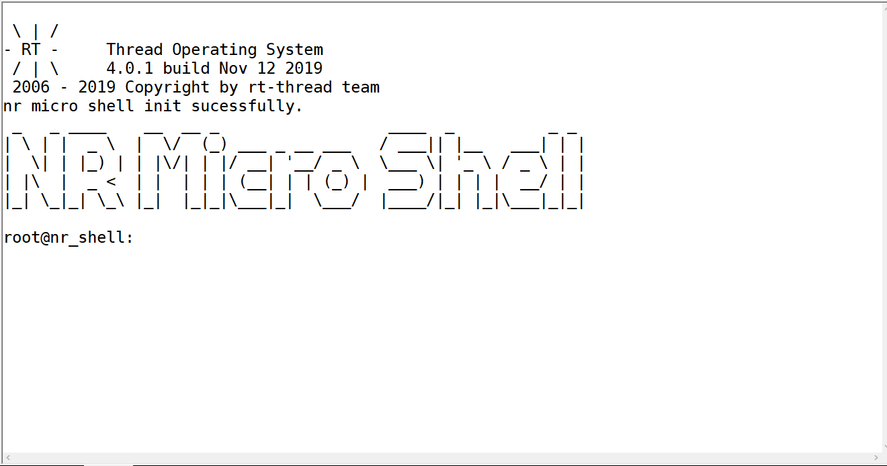

# nr_micro_shell

[English Version](./README_EN.md)

## 1、介绍

在进行调试和维护时，常常需要与单片机进行交互，获取、设置某些参数或执行某些操作，**nr_micro_shell**正是为满足这一需求，针对资源较少的MCU编写的基本命令行工具。虽然RT_Thread组件中已经提供了强大的**finsh**命令行交互工具，但对于ROM、RAM资源较少的单片机，**finsh**还是略显的庞大，在这些平台上，若仍想保留基本的命令行交互功能，**nr_micro_shell**是一个不错的选择。

**nr_micro_shell**具有以下优点

1.占用资源少，使用简单，灵活方便。使用过程只涉及两个shell_init()和shell()两个函数，无论是使用RTOS还是裸机都可以方便的应用该工具，不需要额外的编码工作。

2.交互体验好。完全类似于linux shell命令行，当串口终端支持ANSI（如Hypertrm终端）时，其不仅支持基本的命令行交互，还提供Tab键命令补全，查询历史命令，方向键移动光标修改功能。

3.扩展性好。**nr_micro_shell**为用户提供自定义命令的标准函数原型，只需要按照命令编写命令函数，并注册命令函数，即可使用命令。

**nr_micro_shell**和相同配置下的**finsh** （finsh不使用msh）占用资源对比

|    | 原始工程  | 添加nr_micro_shell增加量 | 添加finsh增加量
|--- | ----- | ------------------- | ----------
|ROM | 63660 | +3832               | +26908
|RAM | 4696  | +1104               | +1304

两者配置都为

- 最多3条历史命令。
- 支持Tab补全 。
- 命令行最大长度为100。
- 最多10个命令参数。
- 命令行线程堆栈为512字节。

nr_micro_shell演示效果如下




### 1.1 目录结构

名称       | 说明
-------- | --------------------------------------------------------------------------------------------
docs     | 文档目录，包含演示的GIF图片等
examples | 例子目录，包括命令函数示例： **_nr_micro_shell_commands.c_** 和RT_Thread下使用示例 **_nr_micro_shell_thread.c_**
inc      | 头文件目录
src      | 源代码目录

### 1.2 许可证

nr_micro_shell package 遵循 MIT 许可，详见 `LICENSE` 文件。

### 1.3 依赖

无依赖

## 2、RT_Thread 下 ENV 工具使用nr_micro_shell package

RT_Thread 使用 nr_micro_shell package package 需要在 RT-Thread 的包管理器中选择它，具体路径如下：

```
RT-Thread online packages
    miscellaneous packages --->
        [*] nr_micro_shell:Lightweight command line interaction tool. --->
```

相关的设置在按下`sapce`键选中后，按`enter`可进行相关参数配置。然后让 RT-Thread 的包管理器自动更新，或者使用 `pkgs --update` 命令更新包到 BSP 中。

若您需要运行示例，请保证RT_Thread配置中的`Using console for kt_printf.`选项是被打开的，kt_printf可以正常工作，且`Use components automatically initialization.`选项打开。编译直接下载或仿真便可以使用nr_micro_shell。命令行空白时按Tab，可显示所有支持的命令，测试示例命令可见doc/pic下的使用示例动图。自定义命令过程，参照下文**3\. 裸机下使用nr_micro_shell package**中的方法。

## 3、裸机下使用nr_micro_shell package

### 3.1 配置:

所有配置工作都可以在 **_nr_micro_shell_config.h_** 中完成。有关详细信息，请参见文件中的注释。

### 3.2 用法:

- 确保所有文件都已添加到项目中。

- 确保 **_nr_micro_shell_config.h_** 中的宏函数"shell_printf()，ansi_show_char()"可以在项目中正常使用。

- 使用示例如下

```c
#include "nr_micro_shell.h"

int main(void)
{
    /* 初始化 */
    shell_init();

    while(1)
    {
        if(USART GET A CHAR 'c')
        {
            /* nr_micro_shell接收字符 */
            shell(c);
        }
    }
}
```

### 3.3 添加自己的命令

**STEP1**:

您需要在**nr_micro_shell_commands.c***中实现一个命令函数。命令函数的原型如下

```c
void your_command_funtion(char argc, char *argv)
{
    .....
}
```

**argc**是参数的数目。**argv**存储每个参数的起始地址和内容。如果输入字符串是

```c
test -a 1
```

则**argc**为3，**argv**的内容为

```c
-------------------------------------------------------------
0x03|0x08|0x0b|'t'|'e'|'s'|'t'|'\0'|'-'|'a'|'\0'|'1'|'\0'|
-------------------------------------------------------------
```

如果想知道第一个或第二个参数的内容，应该使用

```c
/* "-a" */
printf(argv[argv[1]])
/* "1" */
printf(argv[argv[2]])
```

**STEP2**:

在**static_cmd[]**表中注册命令

```c
const static_cmd_st static_cmd[] =
{
   .....
   {"your_command_name",your_command_funtion},
   .....
   {"\0",NULL}
};
```

**_注意：不要删除{"\0"，NULL}！_**

## 4、注意事项

确保您的工程中存在注册表

```c
const static_cmd_st static_cmd[] =
{
   .....
   {"\0",NULL}
};
```

## 5、联系方式 & 感谢

- 维护：Nrusher
- 主页：<https://github.com/Nrusher/nr_micro_shell>
