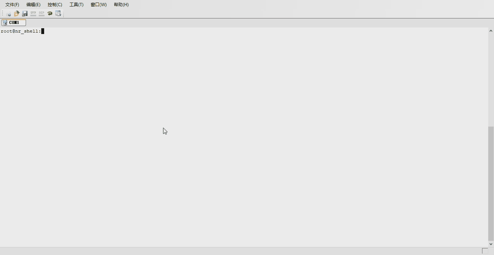

# nr_micro_shell

>[中文版本](https://www.baidu.com)

> Author: Ji Youzhou

> Licence: MIT

> If you think this project will help you, please STAR Github or Gitee to encourage the author. 

- Github address:[nr_micro_shell](https://github.com/Nrusher/nr_micro_shell)

- Gitee address:[nr_micro_shell](https://gitee.com/nrush/nr_micro_shell)

**nr_micro_shell** is designed to provide an interactive experience similar to the command line of Linux shell on MCU (e.g. stm32f103c8t6).

Following functions are provide:

- Basic command line function.

- Use the tab key to complete the command automatically.

- Query history command with direction key.

- Move cursor with direction key.

***Attention: If you want to use the last three functions, you must use a serial terminal software that supports ANSI, such as Hypertrm.***

The following is the test result under the condition of stm32f103c8t6 platform and hypertrm serial port terminal.



## Configure:

All configuration work can be done in the ***nr_micro_shell_config.h***. For details, see the comments in the file.

## Usage:

- Make sure all files have been added into your project.

- Make sure the function 'printf(),putchar()' can be used in your project.

- An example is given as follow

```c
#include "nr_micro_shell.h"

int main(void)
{
    shell_init();

    while(1)
    {
        if(USART GET A CHAR 'c')
        {
            shell(c);
        }
    }
}
```

## Add your own command

**STEP1**: You should realize a command function in ***nr_micro_shell_commands.c***. The prototype of the command function is as follow

```c
void your_command_funtion(char argc, char *argv)
{
    .....
}
```

**argc** is the number of parameters. **argv** stores the starting address and content of each parameter. If your input string is

```c
test -a 1
```

then the **argc** will be 3 and the content of **argv** will be

```c
-------------------------------------------------------------
0x03|0x08|0x0b|'t'|'e'|'s'|'t'|'\0'|'-'|'a'|'\0'|'1'|'\0'|
-------------------------------------------------------------
```

If you want to know the content of first or second parameter, you should use

```c
/* "-a" */
printf(argv[argv[1]])
/* "1" */
printf(argv[argv[2]])
```

**STEP2**: Register you command in the table **static_cmd[]** as follow

```c
const static_cmd_st static_cmd[] =
{
   .....
   {"your_command_name",your_command_funtion},
   .....
   {"\0",NULL}
};
```

***Attention: DO NOT DELETE {"\0",NULL} !***